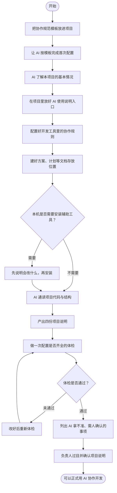
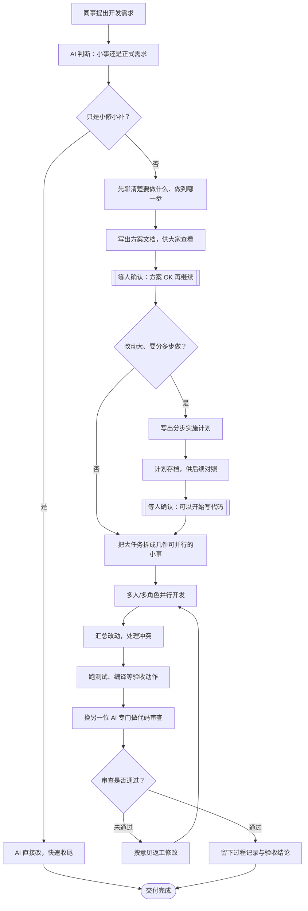

# Harness Kit

可迁移的 Agent Harness 脚手架：把项目规则、工作流路由、过程产物、验证门禁和工具适配打包成一套标准，接入任意代码仓库即可使用。

本仓库是 **Harness 迁移源头**。接入目标项目后，将其放入项目根目录的 `harness-kit/` 下；AI 会据此投影根目录入口文件与工具适配目录，并生成项目画像。

---

## 目录

- [什么是 Harness Engineering](#什么是-harness-engineering)
- [与单纯使用 Skill 的区别](#与单纯使用-skill-的区别)
- [解决什么问题](#解决什么问题)
- [支持的工具](#支持的工具)
- [核心能力](#核心能力)
- [编排术语：WU、Leader、Worker](#编排术语wuleaderworker)
- [流程图](#流程图)
- [推荐阅读顺序](#推荐阅读顺序)
- [目录结构](#目录结构)
- [新项目接入](#新项目接入)
- [接入方式建议](#接入方式建议)
- [更多文档](#更多文档)

---

## 什么是 Harness Engineering

**Harness Engineering** 是围绕 AI Coding Agent 设计约束机制、反馈回路、工作流控制与持续改进的系统工程实践。核心问题是：当 Agent 具备强代码生成能力后，如何保证输出的**可靠性、一致性与长期可维护性**。

**Harness** 本义是马具——用缰绳与鞍具把马力引到正确方向。LLM 像一匹劲大但易跑偏的马；Harness 负责**定向、限速、验货与交接**，而不是限制能力本身。

---

## 与单纯使用 Skill 的区别

许多团队会从 **harness-engineer**、**superpowers** 等 Agent Skill 起步：能力装在 Skill 里，主要靠对话里临时提醒 AI「按某 skill 做」。  
**Harness Kit** 把「这个项目怎么干」写进仓库里的 `harness-kit/` 文件夹：换电脑、换同事、换 Cursor/Codex，拉同一份代码就能沿用同一套规则（见下表）。

| 维度 | 仅使用 Skill | Harness Kit |
|------|-------------|-------------|
| **交付物与可追溯性** | 方案和结论多在聊天记录里，关掉窗口就难找；换人接手要重新讲一遍 | 重要步骤落成仓库里的 Markdown 文件（如方案、计划、验证报告），放在 `.ai-runtime-artifacts/`，带日期和用了哪些 skill，方便 review 和接着做 |
| **多 Agent 协同** | 一个大对话里又设计又写代码又自审，容易前后矛盾、重复读仓库 | 主 Agent 负责协调：实现、审查、探查分给不同子 Agent；能并行的任务拆开做，各看各的上下文，省 token、也减少「自己审自己」的幻觉 |
| **迁移与配置** | Skill 常装在本机用户目录；A 项目和 B 项目各说各话，团队难统一 | **整包跟着 Git 走**：`harness-kit/` 和业务代码一起提交。接入时 AI 会写好「这是什么项目」（`project.profile.md`）、「代码怎么分块读」（`context-map.md`）等。换 Cursor / Codex / Claude 时，从 `adapters/` 投影对应配置，不用重写一套。个人可改 `routing.md` 里的默认路线，团队满意就 commit，变成项目规范 |
| **软件工程工作流** | 每次靠你口头说「先出方案再写代码」；AI 可能跳过设计直接改代码，或方案和实现混在一起 | **默认走固定阶段**：先写方案 → 你确认 → 再写实施计划 → 你确认 → 再动代码 → 最后验证。写方案和计划后 AI **必须停下来等你点头**（阶段门禁）。改个错别字、改一行配置这类小事可以不走全套流程 |

**一句话：** Skill 教 AI **会哪些招**；Harness Kit 规定 **在这个仓库里、按什么顺序、留下什么文件、谁来做哪一步**。

### 迁移与配置：主要文件是干什么的

| 路径 | 说明 |
|------|------|
| `harness-kit/` | Harness 脚手架根目录；随业务仓库一起 clone / submodule，规范与业务代码可分开提交 |
| `harness-kit/project.profile.md` | **项目画像**：技术栈、主要目录职责、禁区、交付口径；初始化时由 AI 扫描生成，含「推断项 / 待确认项」供人工 review |
| `harness-kit/context-map.md` | **上下文地图**：模块边界、目录树与读码优先级，减少 Agent 盲目全仓搜索 |
| `harness-kit/project.verification.md` | **项目验证清单**：本仓库可用的 lint / build / test 命令与最小验证策略 |
| `harness-kit/project.git.md` | **Git 协作差异**：相对组织 `git-xywh` skill 的本项目约束（MR 平台、commitlint、AI 是否可 push）；组织通用流程不复制进仓库 |
| `harness-kit/core/routing.md` | **默认路由表**（Codex / Cursor 并列）与阶段门禁；含 Git 任务 → `git-xywh` + `project.git.md` |
| `harness-kit/core/harness.md` | Harness 总契约：阅读顺序、与 `AGENTS.md` 覆盖层的关系 |
| `harness-kit/core/artifacts.md` | 过程产物目录 `.ai-runtime-artifacts/` 的命名与 front matter 规范 |
| `harness-kit/entrypoints/` | 投影到根目录的入口模板（`AGENTS.md`、`CLAUDE.md`、`GEMINI.md` 等），统一加载 `harness-kit/` |
| `harness-kit/adapters/cursor/` | Cursor 专用：`.cursor/rules/`、`.cursor/agents/harness-*`、`orchestration/` 编排文档 |
| `harness-kit/adapters/codex/` | Codex / OMX 适配说明与 omx 工作流对接 |
| `harness-kit/adapters/agents/` | 通用 `.agents/skills/`（如 `cursor-orchestration`）模板 |
| `harness-kit/init/` | 接入话术见 README「新项目接入」、详版（`bootstrap.prompt.md`）、画像（`project-profiler.prompt.md`） |
| `harness-kit/artifact-templates/` | spec / plan / verification / execution-log 等产物 Markdown 模板 |

---

## 解决什么问题

Harness 工程化常卡在「起步」：规则散落、各工具各一套、验证标准不统一。Harness Kit 的目标是：

1. **降低接入成本** — 将 `harness-kit/` 放入项目，把初始化话术交给 AI 即可。
2. **统一多工具入口** — 同一套规范投影到 Cursor、Codex、Claude Code、Gemini 等环境。
3. **可迁移、可沉淀** — 规范在 `harness-kit/` 中迭代，团队可逐步优化为自有资产。

---

## 支持的工具

接入完成后，项目根目录会出现（或更新）以下入口与适配：

| 类型 | 路径 |
|------|------|
| 顶层契约 | `AGENTS.md` |
| Claude Code | `CLAUDE.md` |
| Gemini | `GEMINI.md` |
| Cursor | `.cursor/rules/`、`.cursor/agents/`（harness-* subagent） |
| Cursor 编排文档 | `harness-kit/adapters/cursor/orchestration/`（不投影，供 AI 读取） |
| Agents / Skills | `.agents/`（含 `cursor-orchestration`） |
| Codex / OMX | `.codex/`（主要由 `omx setup` 生成） |

---

## 核心能力

| 能力 | 说明 |
|------|------|
| **Harness 路由** | 默认 route 为强制基线；`core/routing.md` 提供 Codex 与 Cursor 并列路由表与阶段门禁 |
| **过程产物契约** | `.ai-runtime-artifacts/` 统一存放 spec、plan、verification、execution-log；详见 `core/artifacts.md` |
| **Cursor 子 Agent 编排** | `.cursor/agents/harness-*` + `cursor-orchestration` skill，语义等价于 Codex `omx ultrawork`（见 `adapters/cursor/`） |
| **oh-my-codex / omx** | Codex CLI 多 Agent 运行时编排与高级角色路由 |
| **superpowers** | 结构化思考、计划、调试、TDD、完成前验证等技能链 |

更多 Cursor 集成说明见 `adapters/cursor/README.md`。

---

## 编排术语：WU、Leader、Worker

多 task 实现（Cursor 的 `cursor-orchestration`，或 Codex 的 `omx ultrawork`）时，用下面三个概念分工。详细步骤见 `adapters/cursor/orchestration/dispatcher-workflow.md`。

### WU（Work Unit，工作单元）

从**已批准的实施计划**里拆出的一小块、可独立执行的任务。每个 WU 须满足：

| 要求 | 含义 |
|------|------|
| **有界** | 明确要改哪些文件（通常 ≤5 个写文件） |
| **可验证** | 有完成标准（测试、lint 或检查点） |
| **所有权清晰** | 并行 WU 不修改同一文件，避免冲突 |

多个 WU 按 **GROUP** 分组：组内可并行，组间按依赖顺序执行。示例：

```text
GROUP-1（并行）:
  WU-01: 实现用户 API | 文件: api/users.ts | 依赖: 无
  WU-02: 实现前端列表 | 文件: pages/users.tsx | 依赖: 无

GROUP-2（依赖 GROUP-1）:
  WU-03: 联调 | 文件: hooks/useUsers.ts | 依赖: WU-01 的接口
```

### Leader（编排者）

**Leader = 主 Agent**（Cursor 里即当前 Agent 模式的主会话）。负责路由、从 plan 拆 WU、派发子 Agent、整合结果、跑验证并写 `execution-log`。

| 职责 | 说明 |
|------|------|
| 路由 | 首句声明 `「Harness：…」`，多 task 实现走 `cursor-orchestration` |
| 拆分 | 从 plan 提取 WU，写执行图（GROUP / 依赖 / 文件归属） |
| 派发 | 并行委派 `harness-implementer`（每 WU 一个子 Agent），完成后委派**独立** `harness-reviewer` |
| 整合与验证 | 合并 WU 结果、处理冲突、跑 `project.verification.md` |

**Leader 不应：** 在用户说「开始实现」后，主线程大规模直接改业务代码（routing 定义的「小改动」除外）；实现与审查不得用同一 subagent 实例。

对应关系：Cursor Leader ≈ Codex/OMX 的 leader / dispatcher 编排面。详见 `adapters/cursor/orchestration/agents/leader.md`。

### Worker（工作者）

文档里的 **Worker** 指被 Leader 派出去执行**单个 WU** 的子 Agent。在 Cursor 上主要是 **`harness-implementer`**（`.cursor/agents/harness-implementer.md`）。

| 职责 | 禁止 |
|------|------|
| 只实现 Leader 分配的一个 WU | 不重规划、不派子 Agent、不审查自己的代码 |
| 只改 prompt 中「允许修改」的文件列表 | 不擅自扩 scope；阻塞或范围扩大须**上报 Leader** |

OMX 侧同一套分工（见 `entrypoints/AGENTS.omx.md`）：Leader 选模式、委派有界工作、负责验证；Worker 执行分配切片并向上报告。

> **易混词：** 「work」在 Harness 语境里通常指 **Work Unit（WU）** 或 **Worker（实现者）**；Codex 侧的并行实现工作流名是 **`omx ultrawork`**，在 Cursor 上等价于 **`cursor-orchestration:dispatcher-workflow`**。

### 关系一览

```text
用户批准 plan → 「开始实现」
       ↓
    Leader（主 Agent）— 拆 WU、画 GROUP
       ↓
  并行派发 Worker（harness-implementer），每 Worker 只做 1 个 WU
       ↓
    Leader 整合 → harness-reviewer → execution-log
```

---

## 流程图

面向业务与管理的两张总览图：说明「第一次怎么接上 AI 协作规范」，以及「日常做需求时 AI 怎么配合人、在哪些环节必须等人确认」。

### 新项目接入（初始化）



**四份项目说明：** 项目是什么（技术栈与边界）、代码怎么分块读、改动后怎么验收、Git 协作相对组织规范的差异。

### 日常软件工程运作



**关键原则：** 方案和计划须负责人点头后再动代码；写代码的人与审查的人分开，避免「自己审自己」。

---

## 推荐阅读顺序

以根目录 **`AGENTS.md`** 覆盖层中的列表为准（含 `core/harness.md` 与项目画像路径）。Cursor 会话另见 `entrypoints/AGENTS.cursor-overlay.md`。

---

## 目录结构

```
harness-kit/
├── README.md                  # 本文件
├── project.profile.md         # AI 生成的项目画像
├── context-map.md             # 模块与上下文边界
├── project.verification.md    # 项目级验证规则
├── project.git.md             # Git 协作差异（组织规范用 git-xywh skill）
├── core/                      # 通用 Harness 规则（不随业务重写）
│   ├── harness.md
│   ├── routing.md
│   ├── artifacts.md
│   ├── verification.md
│   └── runbooks.md
├── init/                      # 初始化 prompt 与模板
├── entrypoints/               # 根目录 AI 入口模板
├── adapters/                  # 各工具适配（Cursor / Agents / Codex）
├── scripts/                   # Harness 内部脚本
└── artifact-templates/        # 过程产物模板
```

### 目录职责

| 目录 / 文件 | 职责 |
|-------------|------|
| `core/` | 通用 Harness 规则，不随业务重写 |
| `init/` | 新项目初始化 prompt 与画像模板 |
| `entrypoints/` | 投影到根目录的 AI 入口模板（含 `AGENTS.md`、`AGENTS.omx.md` 等） |
| `adapters/` | 各编程工具的目录模板与编排文档 |
| `scripts/` | 安装、初始化、检查脚本（不投影到根目录） |
| `artifact-templates/` | spec / plan / verification / execution-log 等产物模板 |
| `project.profile.md` 等 | 初始化后由 AI 生成或更新 |

---


## 新项目接入

将本仓库放入目标项目的 `harness-kit/` 后，**无需手工逐步执行**；把以下内容发给AI

```txt
请先读取 harness-kit/README.md 和 harness-kit/init/bootstrap.prompt.md。
这是一个新项目刚接入 Agent Harness，请按 Harness 初始化流程处理：
1. 从 harness-kit/entrypoints/ 投影根目录 AI 入口文件。
2. 从 harness-kit/adapters/ 投影工具适配目录（含 .cursor/agents/、.cursor/rules/ 与 cursor-orchestration skill）。
3. 如需安装或检查 AI runtime，请先说明会修改哪些本机环境，然后由你执行 harness-kit/scripts/install-ai-skills.sh。
4. 创建 .ai-runtime-artifacts/ 及其子目录（含 execution-logs/ 与 execution-logs/tracking/）。
5. 读取并执行 harness-kit/init/project-profiler.prompt.md（以 harness-kit/init/templates/ 为章节骨架，更新四份 project.*，用 project.profile 摘要替换 CLAUDE.md、GEMINI.md 与 harness-kit/entrypoints/HARNESS-PLATFORM-ENTRY.md 中的 {{PROJECT_BACKGROUND}}，并运行 harness-kit/scripts/harness-check.sh）。
6. 汇总推断项、待确认项和验证结果。

详版步骤见 harness-kit/init/bootstrap.prompt.md。

```

**初始化完成后**，AI 应生成或更新：

- `harness-kit/project.profile.md`
- `harness-kit/context-map.md`
- `harness-kit/project.verification.md`
- `harness-kit/project.git.md`

并在回复中说明 Harness 检查结果、推断项与待确认项。

---

## 接入方式建议

| 方式 | 适用场景 |
|------|----------|
| **Git Submodule** | 多项目共用同一份 harness-kit，升级与业务提交分离 |
| **目录拷贝** | 单项目快速接入；Harness 变更请使用独立 commit（如 `chore(harness-kit): ...`） |

无论哪种方式，`harness-kit/` 内的规范迭代与业务代码提交建议分开，便于 review 与回滚。

---

## 更多文档

| 文档 | 说明 |
|------|------|
| `adapters/cursor/README.md` | Cursor 适配与编排 |
| `init/bootstrap.prompt.md` | Bootstrap 详版流程 |
| `core/artifacts.md` | 过程产物命名与 front matter |
| `core/routing.md` | 默认路由与阶段门禁 |
