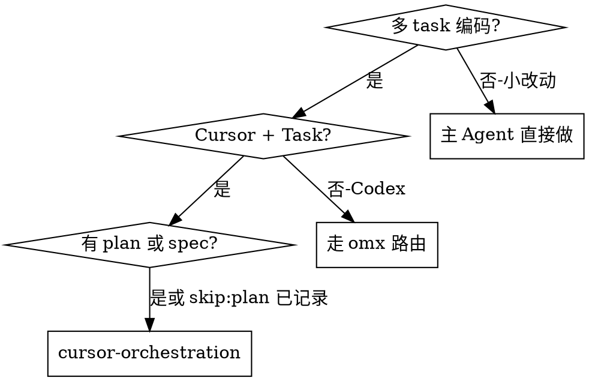

# Cursor Orchestration

Cursor 平台的 **omx ultrawork 语义等价** skill。通过 Task 工具并行派发有界 work unit（WU）。

**平台：** 仅 Cursor（Task 工具可用）。Codex 会话请走 `omx ultrawork`（见 `harness-kit/core/routing.md`）。

---

## 何时使用



**使用条件：**

- 路由判定为「多 task 编码 / 并行实现」
- 平台为 Cursor
- 已有 `.ai-runtime-artifacts/plans/` 中 plan，或 spec 中合法 `skip:plan`

**不要用：**

- 单文件小改动
- Codex / omx 环境
- 范围未界定（先 `superpowers:brainstorming`）

---

## 执行前读取

1. `harness-kit/adapters/cursor/orchestration/dispatcher-workflow.md`
2. `harness-kit/adapters/cursor/orchestration/platform-adapters.zh.md`
3. `harness-kit/adapters/cursor/orchestration/tracking/schema.md`
4. `harness-kit/adapters/cursor/orchestration/agents/leader.md`
5. 已批准 plan 或 spec
6. `harness-kit/project.verification.md`

---

## 执行流程（摘要）

### 1. 声明

首句：`「Harness：cursor-orchestration:dispatcher-workflow」`

### 2. Worktree + Tracking

从 plan 拆 WU → 写执行图 → **创建** `tracking/DISPATCH-TRACK-*.md`（见 `artifact-templates/dispatch-track.md`）。

### 3. 并行 Task

- 同 GROUP 无依赖 WU **并行**派发
- `max_parallel_agents` 默认 3，上限 5
- 实现：`generalPurpose`，prompt 引用 `agents/implementer.md`
- 只读预探：`explore` + `readonly: true`
- 每派发/完成在 tracking 文件 **append** 一条

### 4. 整合

- 合并结果，解决文件冲突
- 运行 project.verification 最小集

### 5. 独立审查

- **必须** 新 Task，prompt 引用 `agents/reviewer.md`
- 与 implementer **不同 Task 实例**（验收硬约束）
- 或叠加 `superpowers:verification-before-completion`

### 6. 产物

写入 `.ai-runtime-artifacts/execution-logs/`，模板见 `harness-kit/artifact-templates/execution-log.md`。

front matter 示例：

```yaml
---
artifact: execution-log
route: superpowers:writing-plans -> cursor-orchestration:dispatcher-workflow
skills:
  - superpowers:writing-plans
  - cursor-orchestration
source:
  - harness-kit/adapters/cursor/orchestration/dispatcher-workflow.md
  - .ai-runtime-artifacts/plans/<plan-file>.md
created_at: YYYY-MM-DD
platform: cursor
---
```

---

## Task Prompt 模板

完整角色面见 `harness-kit/adapters/cursor/orchestration/agents/`。

### Implementer

```markdown
## 角色
你是 Implementer Worker（WU-<id>）。遵循 agents/implementer.md。
不要重规划，不要派发子 Agent。

## 目标
<one sentence>

## Done criteria
- [ ] ...

## 允许修改
- path/a.ts

## 禁止
- 不修改 <other files>

## 返回格式
见 implementer.md § 返回格式
```

### Reviewer（独立 Task）

```markdown
你是 Reviewer。遵循 agents/reviewer.md。你未参与实现。只读。默认怀疑。
对照 spec/plan 与 WU done criteria 审查以下变更：...
```

---

## 上下文与恢复

见 `orchestration/context-budget.md` 与 `orchestration/tracking/schema.md`。

- 单 WU >5 文件 → 拆分
- 上下文 ~40% → `artifact-templates/handoff.md`
- 10 分钟无输出 → 缩小 scope 重派
- 并行编排 **必须** 维护 `tracking/DISPATCH-TRACK-*.md`

---

## 与 harness-kit 路由对齐

| harness-kit 路由 | 本 skill |
| --- | --- |
| `omx ultrawork`（Codex） | **本 skill**（Cursor） |
| `superpowers:writing-plans` | 前置依赖 |
| `superpowers:verification-before-completion` | 后置依赖 |

---

## 禁止

- `omx` CLI、`spawn_agent`、tmux
- 实现与审查同一 Task 实例
- 并行 WU 无 tracking 文件
- 无 execution-log 完成声明
